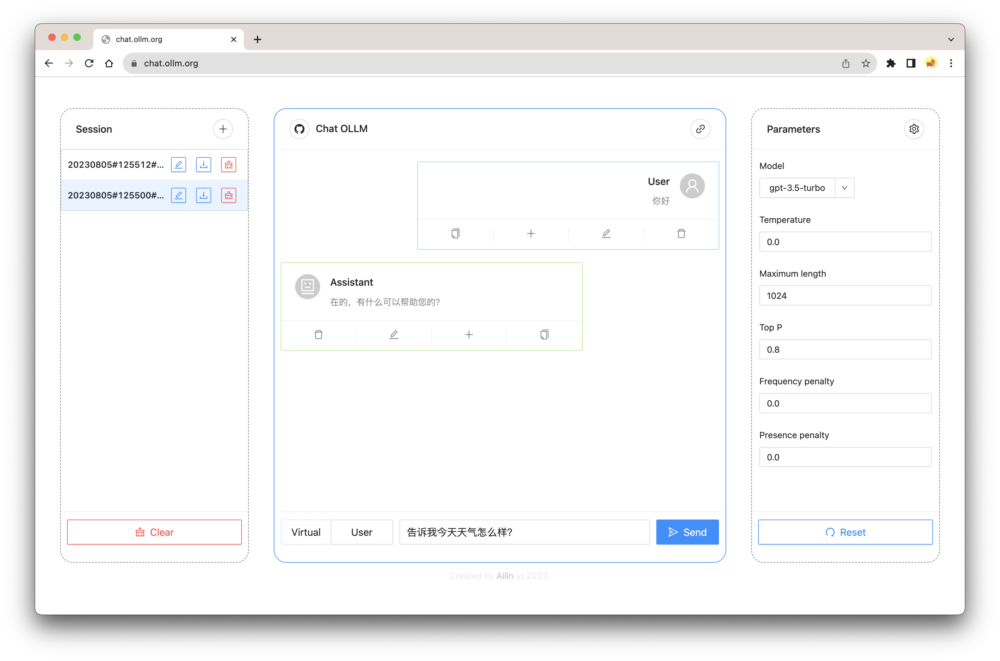

# Chat OLLM

[](https://github.com/Ailln/chat-ollm/blob/main/LICENSE)
[](https://github.com/Ailln/chat-ollm/stargazers)
[](https://github.com/Ailln/chat-ollm/network/members)

🤖️ A web UI for large language models.

## 1 Feature

- [x] Support GPT3 and GPT4
- [x] Simulate historical messages
- [x] Save historical messages locally
- [x] Tuning hyper-parameters
- [ ] Support multiple models

## 2 Preview



## 3 Getting start

```bash
git clone https://github.com/Ailln/chat-ollm.git

cd chat-ollm
# 本地系统环境开发
npm install --registry=https://registry.npmmirror.com
npm run start
# 打开 http://localhost:8000

# 本地 docker 环境开发
docker run -it --name chat-ollm -v $PWD:/app \
  -p 8000:8000 node:16.18.1-slim bash
cd /app
npm install --registry=https://registry.npmmirror.com
npm run start
```

## 4 Deploy

### 4.1 Docker

```bash
cd chat-ollm

docker build -t chat-ollm:1.0.0 .
docker run -d --restart=always --name chat-ollm \
  -p 8000:80 chat-ollm:1.0.0
# 打开 http://localhost:8000
```

### 4.2 Kubernetes

```bash
# 需要 docker registry
docker tag chat-ollm:1.0.0 192.168.2.101:5000/chat-ollm:1.0.0
docker push 192.168.2.101:5000/chat-ollm:1.0.0

cd chat-ollm
kubectl apply -f deploy/deployment.yaml
# 打开 http://localhost:30100
```

## 5 Reference

- [Ant Design](https://ant.design/)
- [React](https://reactjs.org/)
- [OpenAI](https://openai.com/)

## 6 License

[](./LICENSE)
[](https://github.com/Ailln/award)
